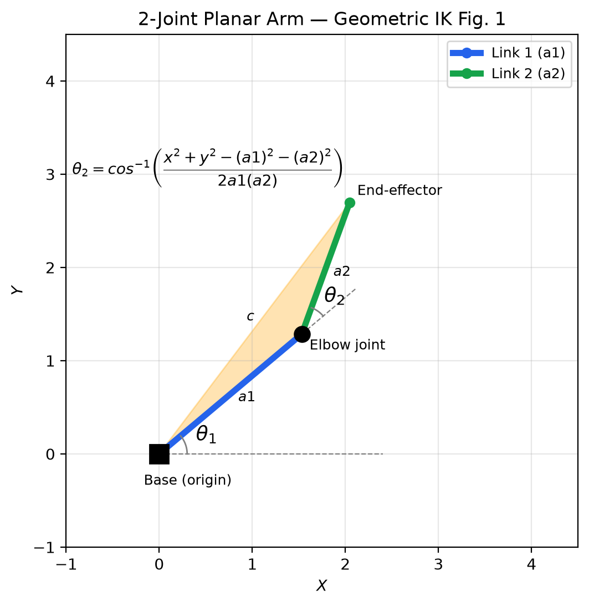
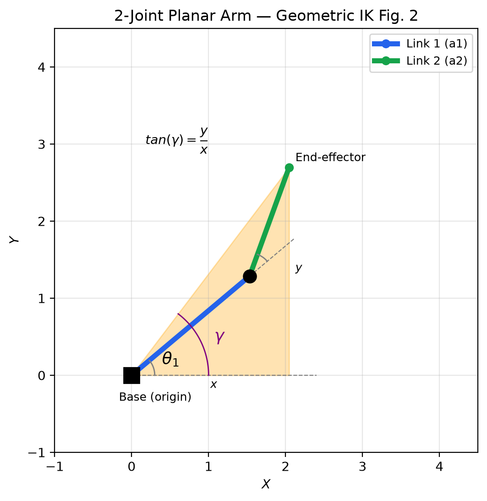
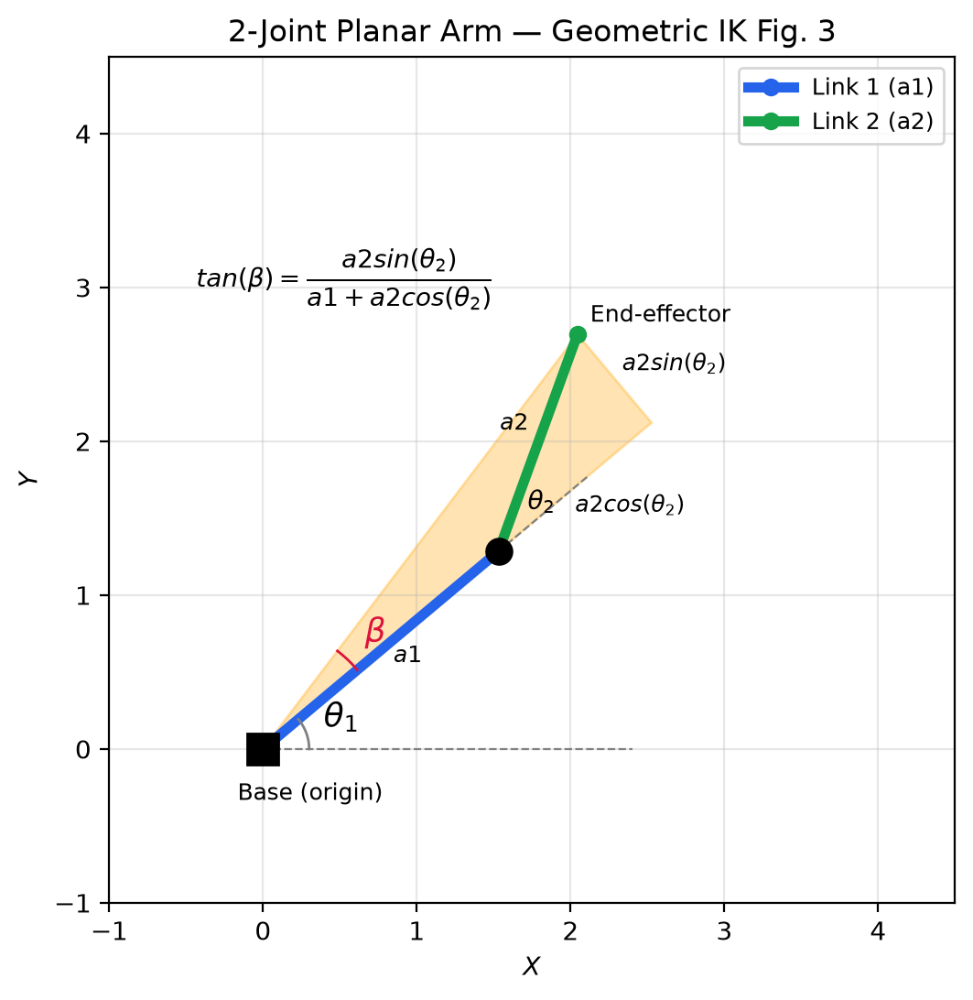

# Geometric vs. Jacobian Inverse Kinematics
### A Technical Comparison for a Planar Robotic Arm
*Simon Dudek · July 2026*

---

## Abstract
In the field of robotics, Inverse Kinematics is frequently used, however there are multiple approaches to using Inverse Kinematics. This paper will investigate the differences between 2 approaches solving for the angles needed to place the end effector of a kinematic chain, that being the Jacobian Damped Least Squares Pseudoinverse(Jacobian DLS) and Geometric Inverse Kinematic. This research was conducted by creating a simulation of a 2 joint articulated structure and using different approaches inverse kinematics to find the angles needed for the structure's end effector to reach the point. Data was then collected concerning the time, error, and iterations used in both approaches following the same points, under 2 different conditions, one having completely random points and the other having points that were more predictably stepped. This data displayed a clear trend of Jacobian DLS Kinematics freezing when encountering 2 points far from each other, and otherwise showed a slower mean time and error that that of Geometric Kinematics. From this study, we were able to conclude that Geometric Inverse Kinematics is more reliable and faster when working with 2 joints, and that Jacobian DLS Kinematics often yields slightly less accurate results, and can be unreliable; however, it is far easier to expand with more joints and can be accurate if used outside of stress testing.

---

## 1. Introduction
Inverse Kinematics is the study of the motion required for an articulated structure to reach a position. Inverse Kinematics is mostly used in fields such as robotics, as it is the main process behind structures such as robotic arms being able to reach designated positions. It is, however, far more difficult to find the position of the arm from the point than than finding the point from the position. Because of this problem, multiple approaches have been created to find the Inverse Kinematic. The main 2 types of approaches I will be focusing on are analytical and numerical Inverse Kinematics. Analytical Inverse Kinematics uses exact, mathematical solutions for closed-form equations, and Numerical Inverse Kinematics uses iterative optimization algorithms to approximate final positions. Specifically, I will be using a Geometric Closed-Form Inverse Kinematic Approach as my Analytical method, and the Jacobian DLS Inverse Kinematic approach for my Numerical method. The Geometric Approach uses the Law of Cosines and trigonometric identities to find exact final positions for the arm, and the Jacobian DLS will use Jacobian Matrixes to iteratively move the end-effector closer to a target until it is within tolerance. One of the largest limiting factors of analytical approaches is lack of generalization, so therefore when drawing from direct comparison data, I will use 2 joint articulated structures on a 2d plane, as it is not possible to use a geometric approach on a structure with 3 or more joints. A Numerical approach, such as the Jacobian, are usually easy to generalize, but for the sake of the study I will be drawing data from the same conditions. I am mainly comparing these 2 approaches in order to show the advantages and disadvantages of each method, and when each should be used. 

## 2. Geometric Closed-Form Inverse Kinematics
### 2.1 Method
Using Geometric Closed-Form Inverse Kinematics, we can find the joint angles for a 2 joint arm using multiple formulas, and find 2 different possible angle outcomes. Due to the nature of being closed-form, this will lead to an exact outcome but will only work with 2 joints. To begin, we can define our joint angles as $\theta_1$ and $\theta_2$ for joints 1 and 2 respectively, and use $\phi$ as the angle of the elbow between the 2 links. We can also use $c$ to represent the length from the end effector to the base, and $a1$ and $a2$ to represent the lengths of links 1 and 2 respectively. Because we know that $\phi$ and $\theta_2$ are supplementary, we can also state that $\theta_2 = \pi - \phi$. Using the cosine angle difference identity $\cos(\pi - x) = -\cos(x)$, we can state that $-\cos(\phi) = \cos(\theta_2)$. We can then use the Law of Cosines, represented by the formula $c^2 = (a1)^2 + (a2)^2 - 2(a1)(a2)\cos(\phi)$, and simplify it to solve for $-\cos(\phi)$ with the formula $-\cos(\phi) = \frac{x^2 + y^2 - (a1)^2-(a2)^2}{2a1(a2)}$. We can now use our cosine angle difference identity to plug $cos(\theta_2)$ in for $-\cos(\phi)$ and solve for $\theta_2$, giving us the equation $\theta_2 = \cos^{-1}\left(\frac{x^2+y^2-(a1)^2-(a2)^2}{2a1(a2)}\right)$ We can also easily find the angle used for the elbow up outcome by multiplying the solution by $-1$

*Figure 1: Geometric IK setup to find $\theta_2$ for a 2-joint planar arm.*

In order to find $\theta_1$, we must use the formula $\theta_1 = \gamma - \beta$. In this case, $\gamma$ is the angle between the horizontal line running through the base and the line stretching from the base to the end-effector. In the following formula, we  will also use $x$ and $y$, which can be associated with c with the assertion that $c^2 = x^2 + y^2$, or in other words, $x$ is the horizontal distance of the end-effector from the base, and $y$ is the vertical distance of the end-effector from the base. Using these variables, we can state $\gamma$ is found using the equation $\gamma = \tan^{-1}(\frac{y}{x})$.

*Figure 2: Geometric IK setup to find $\gamma$ for a 2-joint planar arm.*

Next, we must find the $\beta$ angle, which is the angle between the 1st link and the line stretching from the base to the end effector. This angle can be found by using $\theta_2$ and $a2$ to create a new right triangle, and then using the tangent ratio of $\tan(\beta) = \frac{a2\sin(\theta_2)}{a1+a2\cos(\theta_2)}$, which, when solving for $\beta$, can be simplified to $\beta = \tan^{-1}(\frac{a2\sin(\theta_2)}{a1+a2\cos(\theta_2)})$.

*Figure 3: Geometric IK setup to find $\beta$ for a 2-joint planar arm.* 

Now that $\beta$ and $\gamma$ are known, $\theta_1$ is easy to find. If we use the formula from before, we can simply plug our numbers into $\theta_1 = \gamma - \beta$, we can get the formula for finding $\theta_1$ in relation to $\theta_2$, which is $\theta_1 = \tan^{-1}(\frac{y}{x}) - \tan^{-1}(\frac{a2\sin(\theta_2)}{a1+a2\cos(\theta_2)})$. Using this formula, paired with the formula $\theta_2 = \cos^{-1}\left(\frac{x^2+y^2-(a1)^2-(a2)^2}{2a1(a2)}\right)$, we can easily find the joint angles for most in range end-effector positions for a 2 joint articulated structure.

### 2.2 Usage
Geometric Closed-Form Inverse Kinematics works best when there are only 2 joints, no irregular shapes, and no constraints. This is because Geometric Inverse Kinematics cannot be expanded past 2 joints, and cannot account for movement constraints past being able to select whether the elbow is above or below the end-effector. One of the greatest benefits of Geometric Closed-Form Inverse Kinematics is the reliability and minimal computational cost of using it, as the time and cost is nearly minimal whilst still achieving a moderate reliability.

Geometric Closed-Form Inverse Kinematics does suffer from a few limitations, though; it cannot derive angles from any points that cause the $\phi$ angle to measure at $180\degree$, or in other words a location that would lead both links to be collinear. Geometric Closed-Form Inverse Kinematics also cannot handle any locations where the $\phi$ would measure at $0\degree$, or when the arm would fold in on itself. These locations are called singularities. By far the largest disadvantage is its lack of generalization, as it can only be used on 2 joint planar structures, and is unable to account for the paths to get to locations. Therefore, any constraints that might be used are usually neglected, which may cause issues in certain applications.

Due to all these factors, we can see that Geometric Closed-Form Inverse Kinematics are useful where a low cost, deterministic method for Inverse Kinematics on a 2 joint planar arm without constraints is necessary. Geometric Inverse Kinematics can provide exact and precise solutions to such systems, but will likely be unable to function if any expansion or generalization is done. Because of this, we can see that Geometric Closed-Form Inverse Kinematics is usually not useful outside of very specific application.

## 3. Jacobian-Based Inverse Kinematics
### 3.1 The Jacobian Matrix
The Jacobian Matrix itself is essentially a 2d matrix that compiles all the first order partial derivatives of a multivariable vector scaled function. In this context, the partial derivatives explain how the sensitivity of a function, and creates an output ratio describing how a multivariable function would change depending on the input. The Jacobian Matrix has the shape $m \times n$, where $m$ is the number of output components and $n$ is the number of input variables. We can write the  formula for the Jacobian Matrix with $$J = \begin{bmatrix}
    \frac{\partial f_1}{\partial x_1} & \cdots & \frac{\partial f_1}{\partial x_n} \\
    \vdots & & \vdots \\
    \frac{\partial f_m}{\partial x_1} & \cdots & \frac{\partial f_m}{\partial x_n}
\end{bmatrix}$$ In the case of a 2 joint articulated arm on a 2d plane, there are 2 output components describing the $x$ and $y$ movement of the end-effector, and 2 input variables, describing the angles of each joint. If we want to write out x and y as multivariable functions, we can say $x(\theta_1, \theta_2) = l_1 \cos(\theta_1) + l_2 \cos(\theta_1 + \theta_2)$, and $y = l_1\sin(\theta_1) + l_2\sin(\theta_1 + \theta_2)$. Together, this essentially works to show how change in the angles of each joint affects the position of the end-effector. For our use case, the Jacobian Matrix should look something like $$J = \begin{bmatrix}\frac{\partial x}{\partial \theta_1} & \frac{\partial x}{\partial \theta_2} \\ \frac{\partial y}{\partial \theta_1} & \frac{\partial y}{\partial \theta_2} \end{bmatrix}$$ Now, if we take the partial derivatives of each $(x,y)$ equation, we get a final matrix, with the first column being evanluated in respect to the $\theta_1$ and the second in respect to $\theta_2$
$$J = \begin{bmatrix}  -l_1 \sin(\theta_1) - l_2 \sin(\theta_1 + \theta_2) & -l_2 \sin(\theta_1 + \theta_2) \\  l_1 \cos(\theta_1) + l_2 \cos(\theta_1 + \theta_2) & l_2 \cos(\theta_1 + \theta_2)  \end{bmatrix}$$

### 3.2 The Pseudoinverse Update Rule
After getting the Jacobian Matrix of the arm, we must now use it to find how to get the end-effector to the end location. The formula used in order to find how to get to the final location is $\Delta x \approx J \Delta \theta$, with $x$ being the vector going from the tip of the end-effector to the target. This is also often called the error vector. Because we are trying to solve for the changes in angles necessary to reach the target, we must rearrange this equation to solve for the error vector. In order to do so, one can easily assume that we will simply take the inverse of the Jacobian; however, this is not preferred, because firstly, it limits us to only using a 2 joint arm because only a 2 joint arm will yield a square matrix, and because it may cause singularities due to the fact that matrixes cannot be inverted if their determinant becomes 0. Because of this, it is preferrable to take the Moore-Penrose Pseudoinverse, which will give us a generalization of the Jacobian Matrix's inverse with the least possible magnitude, written $J^\dagger$. This is preferrable because it will give us the inverse with the least possible movement necessary to reach the target. The equation to find the Moore-Penrose Pseudoinverse is the formula $J^\dagger = J^T (J J^T)^{-1}$. This does give us the Pseudoinverse; however, this introduces new singularities. Because $J \cdot J^T$ is only inversable if $J$ has full rank, or if all rows and columns have non-zero values, when $J$ approaches zero we can get singularities. Because of this, we can modify this equation to a Damped Least Squares Pseudoinverse, which adds a small multiple of an identity matrix. The new, final pseudoinverse equation is $$ J^\dagger = J^T(JJ^T + \lambda^2 I)^{-1}$$
In this formula, $\lambda$ represents a small damping number, in the case of the arm $0.1$ typically works suitably, and the $I$ is an identity matrix, in this case we use a 2x2 identity matrix. A higher of $\lambda$ will reduce the accuracy, and lowering the value can create the risk of a singularity, so finding a good $\lambda$ value is important to the application. After we have the pseudoinverse, all me must do is use the equation $J^\dagger \Delta x = \Delta \theta$, and we get an approximation of the angles needed. While this does create an approximation, it is usually innacurate, so this process is applied again after the previous iteration until the error vector is sufficiently small, in my case, I measured the distance of the vector, and if it was less than my tolerance of 1e-4 than I would accept it.

### 3.3 Convergence and Stability
Using all of these methods, the singularities are mostly solved. There is still one situation where Jacobian does fail, and it is with locations where only one elbow configuration can reach a destination due to joint constraints. Whenever there is a point, it can be reached in 2 ways, one where the elbow joint falls above the end-effector, and one where it falls below the end-effector. When we introduce angle limits to joints, it can lead to some points that are only reachable with certain elbow configurations. This can lead to the Jacobian attempting to try a configuration that doesnt work, and leading to the joints getting stuck at their limits. This usually does not occur if we are looking at usual targets, but during random target testing this can show a visible cluster of data where the arm was stuck at its limit and could not reach the target. When working with 3 joint links, one can use the Null Scape Projection approach, defined by the formula $\Delta \theta = J^{\dagger} e  + (I - J^{\dagger}J)\Delta \theta_{\text{null}}$, where $e$ is the error, $I$ is an identity matrix and $\theta_{\text{null}}$ is a secondary goal of the process. If we set $H(\theta) = \frac{1}{2} \sum_{i=1}^{n} \left( \frac{\theta_i - \theta_{i,\text{mid}}}{\theta_{i,\text{max}} - \theta_{i,\text{min}}} \right)^2$, then we can set $\Delta \theta_{\text{null}} = -k \nabla H(\theta)$ we can create a system that keeps the joints away from their limits, where $\nabla H(\theta)$ is the gradient pointing towards the limits of each joint, and $k$ is the scalar gain, or the step-size that dictates the power for the joint limit avoidance. We can then multiply the $\Delta \theta_{\text{null}}$ by $(I - J^\dagger J)$ to find solutions to keep from the joint limits without moving the end-effector position, as a secondary process to moving the end-effector to the target position.

All in all, as we can see Jacobian DLS Inverse Kinematics typically has much smaller room for error than geometric inverse kinematics, but can be less reliable on a 2 joint arm. Because of this, Jacobian typically is more useful due to its ability to generalize, but not as useful on very specific applications that only require a 2 joint setup. Geometric also has a much lower cost, and as we will see Jacobian can waste a lot of computer resources when compared to geometric. This shows how Jacobian can be more versatile but less reliable in specific situations when compared to geometric.

## 4. Comparison
[Table + discussion]

## 5. Results
[Plots from your implementation — embed as images]

## 6. Conclusion
[What you learned, real-world implications]

## 7. References
https://www.mathworks.com/discovery/inverse-kinematics.html
https://www.mdpi.com/2218-6581/13/6/91
https://robotacademy.net.au/lesson/inverse-kinematics-for-a-2-joint-robot-arm-using-geometry/
https://medium.com/@manuelmort/inverse-kinematics-of-two-link-planar-arm-geometric-approach-5f3ffdfde16d
https://machinelearningmastery.com/a-gentle-introduction-to-the-jacobian/
